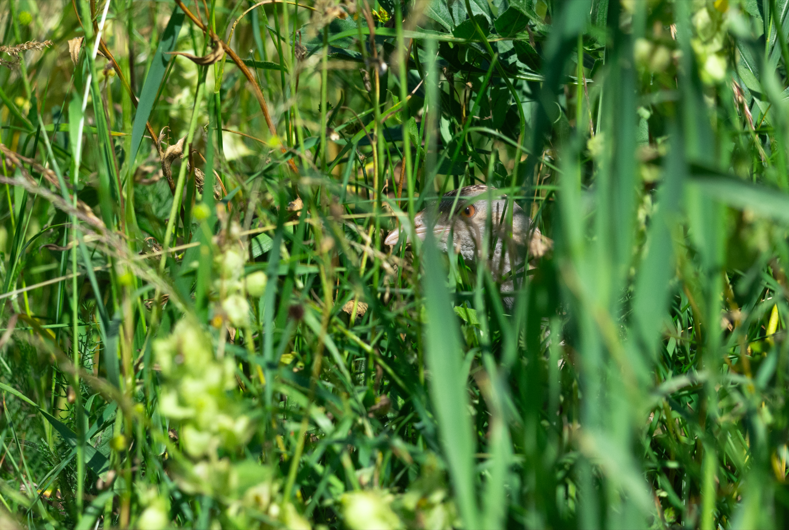

{fig-align="center" width="800"}

# Analyse de phénologie de chant des Râles des genêts par acoustique passive

Ce projet Github contient un ensemble de fichiers pour pouvoir étudier la phénologie de chant du Râle des genêts (*Crex crex*) à partir de données d'acoustique passive (audiomoth ou SM).

Ce suivi est basé sur 1 minute d'enregistrement par tranche de 10 minutes en continu toute la journée, soit 144 enregistrements par jour.

Dans le dossier "analyses", le fichier "script_analyses.Qmd" contient toutes les étapes pour analyser et explorer les données audio.\
Dans le dossier "data", vous retrouverez un exemple de dossiers et figures issues de ce fichier Qmd.

Ce Github sera mis à jour, n'hésitez pas à revenir pour vous informer des dernières mises à jour, et à remonter d'éventuel problème de script (ou améliorations).

Bonnes analyses !

Ryan BOSWARTHICK